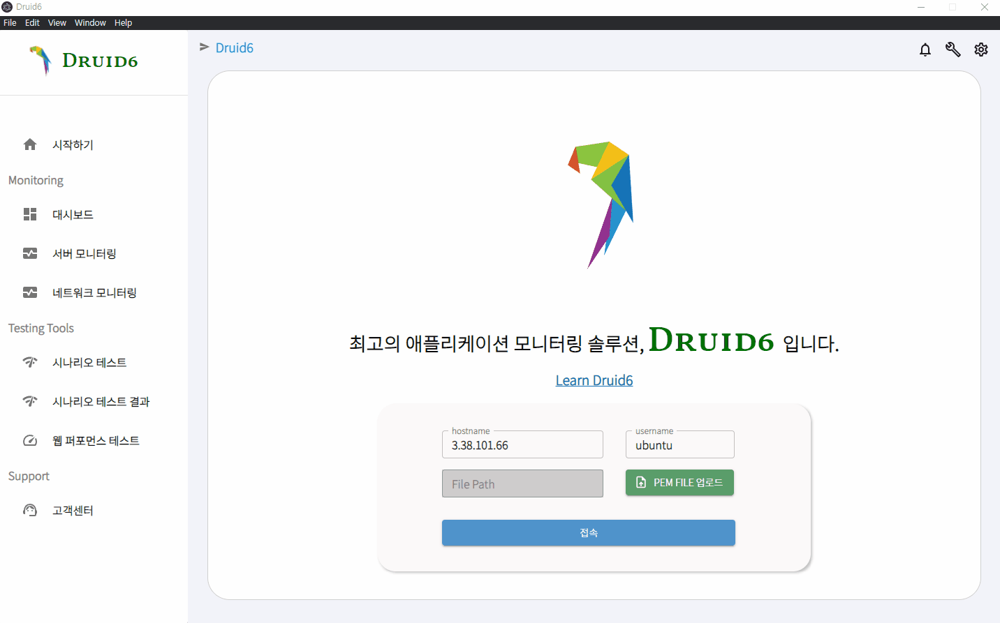
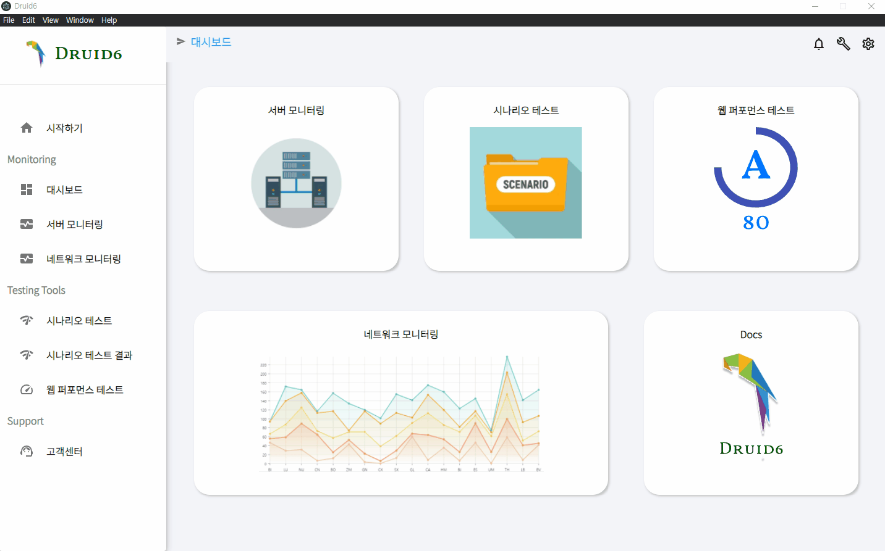
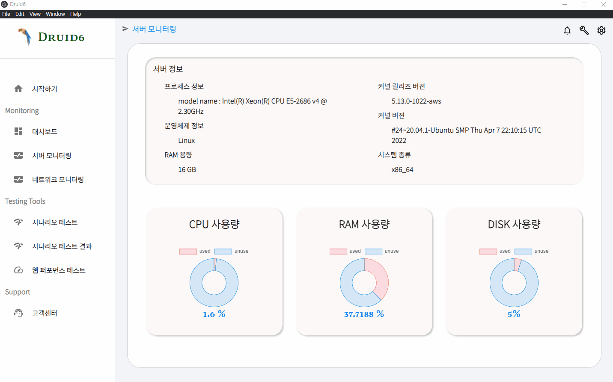
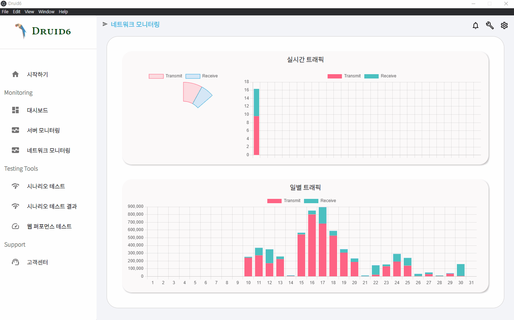
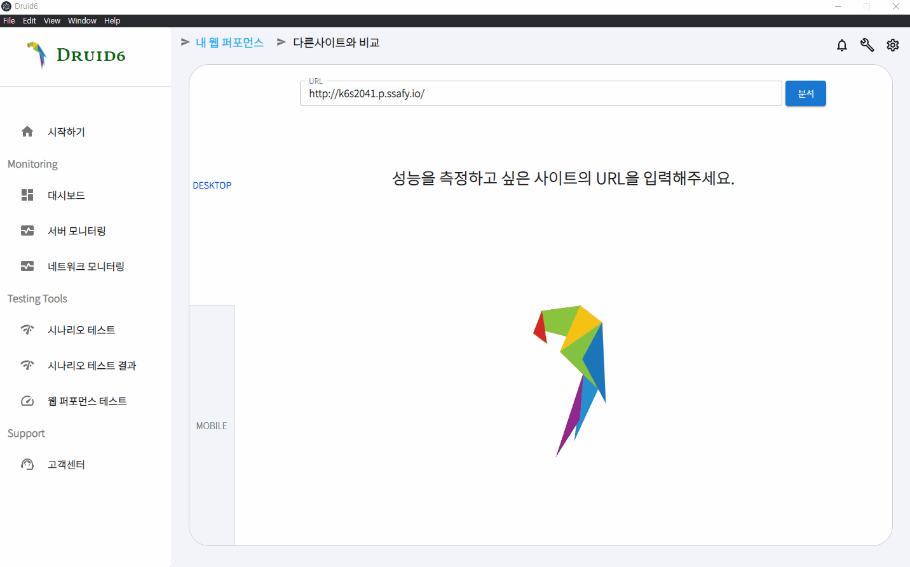
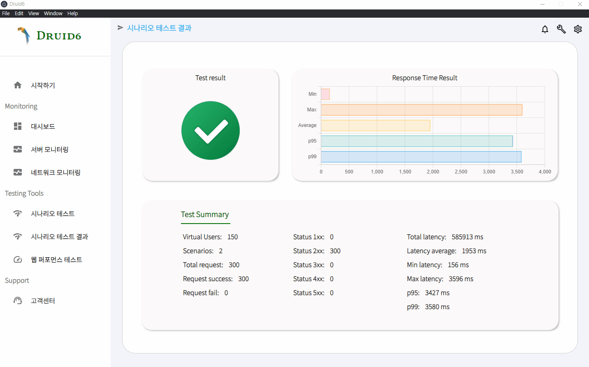

<br>

# Druid6

### 애플리케이션 모니터링의 완벽한 시작, Druid6

> 사용자가 서비스하는 웹 페이지의 퍼포먼스 체크 및 네트워크 모니터링, 시나리오 테스트 등을 할 수 있는 어플리케이션입니다.


서버관리, 시나리오 테스트, 웹 퍼포먼스 체크같은 기능을 제공하여 초보개발자를 위한 서비스

초보개발자를 위한 솔루션 `Druid6`가 제공합니다.

<br>

-----

<br>

## 🦜 주요기능

- 서버 모니터링
- 네트워크 모니터링
- 웹 퍼포먼스 테스트
- 시나리오 테스트

<br>

-----

<br>

## 🐤 세부기능

|      | 기능                 | 설명                                                         |
| :--- | -------------------- | ------------------------------------------------------------ |
| 1    | 서버 모니터링        | 1. Ipc Main에서 ssh2 라이브러리를 사용해서 원격 서버에 접속하여 쉘스크립트를 통해 서버의 정보를 가져오기<br />2. Ipc Main에서 IpcRenderer로 ipc통신 및 렌더링 |
| 2    | 네트워크 모니터링    | 1. Ipc Main에서 ssh2 라이브러리를 사용해서 원격 서버에 접속하여 vnstat를 통해 실시간 트래픽 및 일별 트래픽 정보를 가져오기 <br />2. Ipc Main에서 ipcRenderer로 ipc통신 및 렌더링 |
| 3    | 웹 퍼포먼스 모니터링 | 1. 웹 퍼포먼스 테스팅을 진행할 URL 입력 <br />2. google lighthouse 분석 결과 데스크톱 & 모바일 버전 나눠 상태 저장 <br />3. 파싱 후 웹 퍼포먼스 점수 및 핵심 값 6개, 솔루션 계산 후 렌더링 <br />4. redux로 다른 웹 사이트의 결과와 함께 저장 |
| 4    | 시나리오 테스트      | 1. URL, Method, Body, Response, web-worker 수를 입력하여 시나리오를 redux로 저장 <br />2. web-worker를 활용해 각 시나리오를 multi-thread 방식으로 수행 <br />3. 결과항목을 redux로 저장해 결과페이지로 이동 후 결과 표시 |

<br>

-----

<br>

## 🌎 아키텍처


<br>

-----

<br>

## 🛠 설치가이드

- [https://druid6.netlify.app](https://druid6.netlify.app) 에 접속


- 메인페이지의 ‘다운로드’ 버튼 클릭
1. **druid6-0.1.0.exe** 파일 클릭.(관리자 권한 실행 요망)
   
    
    
2. 설치 프로그램이 druid6를 자동으로 설치
   
    
    
3. 설치가 완료되면 **마침** 버튼을 눌러 실행 가능.
   
    
    

<br>

-----

<br>

## 🎞 사용 예시

### :computer: PC 버전 서비스 화면

| 메인페이지                                |
| ----------------------------------------- |
|  |

|                대시보드                 |                  서버 모니터링                  |
| :-------------------------------------: | :---------------------------------------------: |
|  |  |

|                    네트워크 모니터링                     |                   웹 퍼포먼스 테스트                    |
| :------------------------------------------------------: | :-----------------------------------------------------: |
|  |  |

|                   시나리오 테스트                    |                     시나리오 테스트 결과                     |
| :--------------------------------------------------: | :----------------------------------------------------------: |
|  |  |

<br>

-----

<br>

## 🐣 릴리즈 히스토리

히스토리 작성이 필요한 경우, 영어로 작성하되, 괄호 안에 한글 설명을 첨부하셔도 됩니다.

- 0.0.1
    - Work in progress


<br>

-----

<br>

## 🎨 팀원정보

---

|               김태호               |              오윤기               |               현종일                |
| :--------------------------------: | :-------------------------------: | :---------------------------------: |
|   |  |  |
|         **Leader & UI/UX**         |         **Scenario Test**         |          **Scenario Test**          |
| https://github.com/onys-programmer |    https://github.com/Yun-GiOh    |  https://github.com/Leo-SingleDay   |

|                박윤지                |                 서형준                  |                신동호                |
| :----------------------------------: | :-------------------------------------: | :----------------------------------: |
|     |  |   |
| **MicroSIte <br />& WebPerformance** |  **Server <br />& Network Monitoring**  | **MicroSIte <br />& WebPerformance** |
|    https://github.com/underwater2    |       https://github.com/kenny397       |     https://github.com/sdh98429      |

<br>

-----

<br>

## 🎇 컨트리뷰트 가이드

### **개발 서버 실행하기**

1. `yarn install` 명령어를 사용하여 node_modules를 다운받습니다.
2. `yarn electron:serve` 명령어를 사용하여 hot-reloading 일렉트론 개발 서버를 시작합니다.

<br>

### 기여방법

> Druid6에 기여하고 싶으신가요?


### **가이드라인**

이 문서는 목적이 다른 여러 섹션으로 나뉘게 됩니다. 문장을 추가할 계획이라면, 적절한 섹션에 대한 [가이드라인](https://github.com/Druid6/druid6)을 숙지하는 것이 도움이 될 것입니다.


### **브랜치(branch) 만들기**

1. 로컬 저장소에서 `git checkout master`를 실행합니다.
2. `git pull origin master`를 실행하여 최신 원본 코드를 보장할 수 있습니다.
3. `git checkout -c the-name-of-my-branch` (`the-name-of-my-branch` 를 적절한 이름으로 교체)를 실행하여 브랜치를 만들고 그 브랜치로 이동합니다.


### **수정하기**

1. "개발 서버 실행하기" 부분을 따릅니다.
2. 파일을 저장하고 일렉트론 앱에서 확인합니다. 


### **수정사항 체크하기**

1. 변경한 부분에 대해서 가능하다면 많은 서버에서 제대로 작동하는지 확인해주세요.
2. 프로젝트 루트에서 `yarn check-all`를 실행합니다. (이 명령어는 Prettier, ESLint, 그리고 Flow를 실행합니다.)


### **Push 하기**

1. `git add -A && git commit -m "My message"` (`My message` 부분을 `Fix header logo` 같은 커밋 메시지로 교체)를 실행하여 변경한 파일들을 commit 해주세요.
2. [Druid6 repo](https://github.com/Druid6/druid6)에서 최근에 푸시된 브랜치를 볼 수 있습니다.
3. Github 지침을 따라주세요.
4. 가능하다면 시각적으로 변화된 부분의 스크린샷을 첨부해주세요. PR을 만들고 다른사람들이 수정사항을 볼 수 있게되면 자동으로 빌드할 것입니다.


<br>

-----

<br>

## 🌎 라이선스

```jsx
Copyright (c) Druid6 contributors
Copyright (c) 2013-2020 GitHub Inc.

Permission is hereby granted, free of charge, to any person obtaining
a copy of this software and associated documentation files (the
"Software"), to deal in the Software without restriction, including
without limitation the rights to use, copy, modify, merge, publish,
distribute, sublicense, and/or sell copies of the Software, and to
permit persons to whom the Software is furnished to do so, subject to
the following conditions:

The above copyright notice and this permission notice shall be
included in all copies or substantial portions of the Software.

THE SOFTWARE IS PROVIDED "AS IS", WITHOUT WARRANTY OF ANY KIND,
EXPRESS OR IMPLIED, INCLUDING BUT NOT LIMITED TO THE WARRANTIES OF
MERCHANTABILITY, FITNESS FOR A PARTICULAR PURPOSE AND
NONINFRINGEMENT. IN NO EVENT SHALL THE AUTHORS OR COPYRIGHT HOLDERS BE
LIABLE FOR ANY CLAIM, DAMAGES OR OTHER LIABILITY, WHETHER IN AN ACTION
OF CONTRACT, TORT OR OTHERWISE, ARISING FROM, OUT OF OR IN CONNECTION
WITH THE SOFTWARE OR THE USE OR OTHER DEALINGS IN THE SOFTWARE.
```