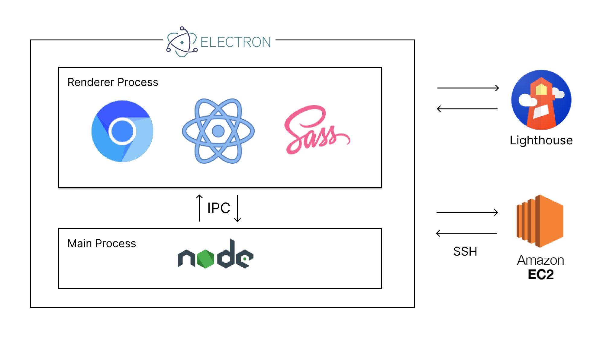
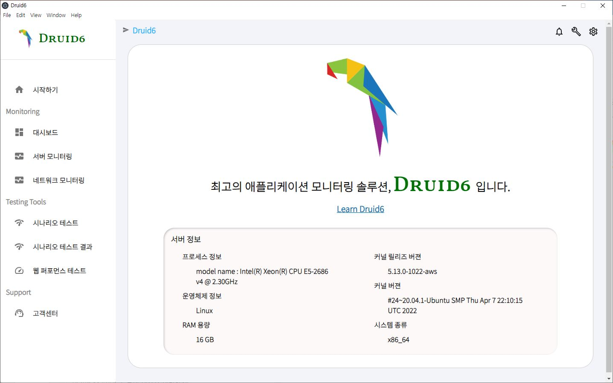
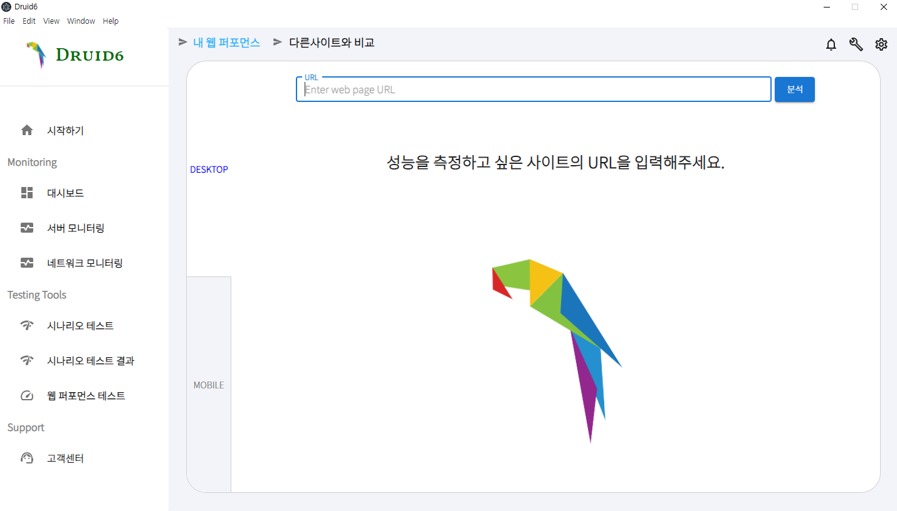
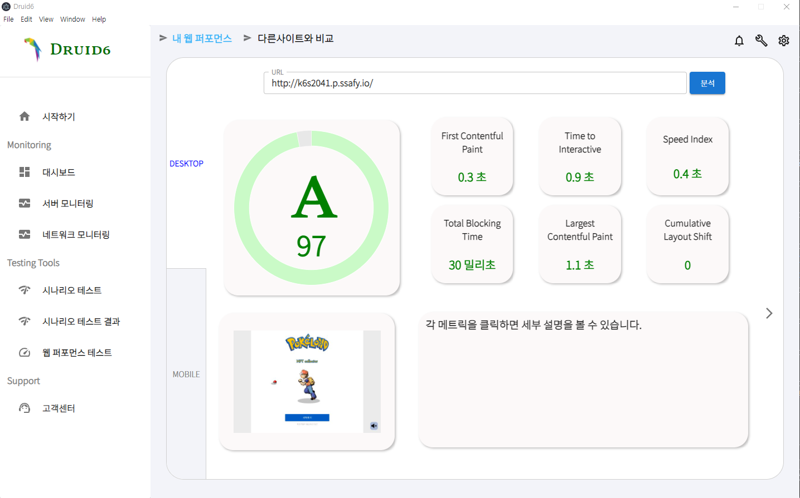
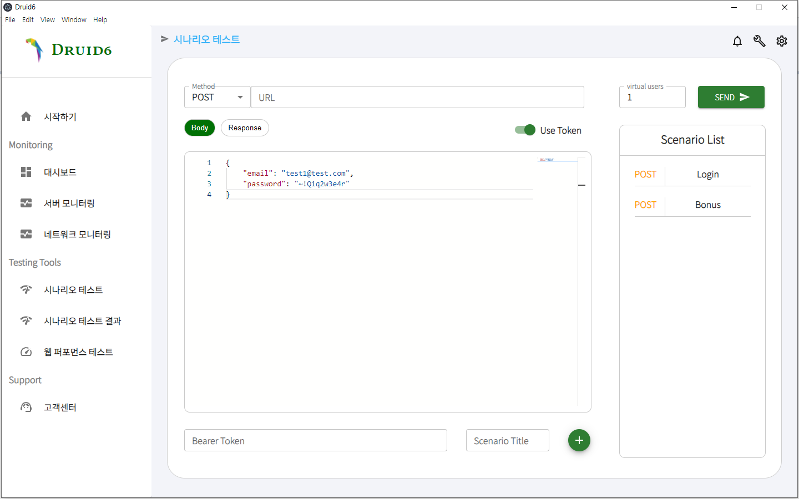
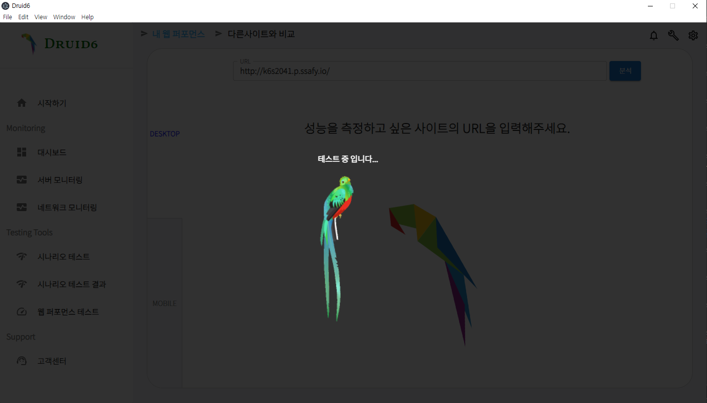
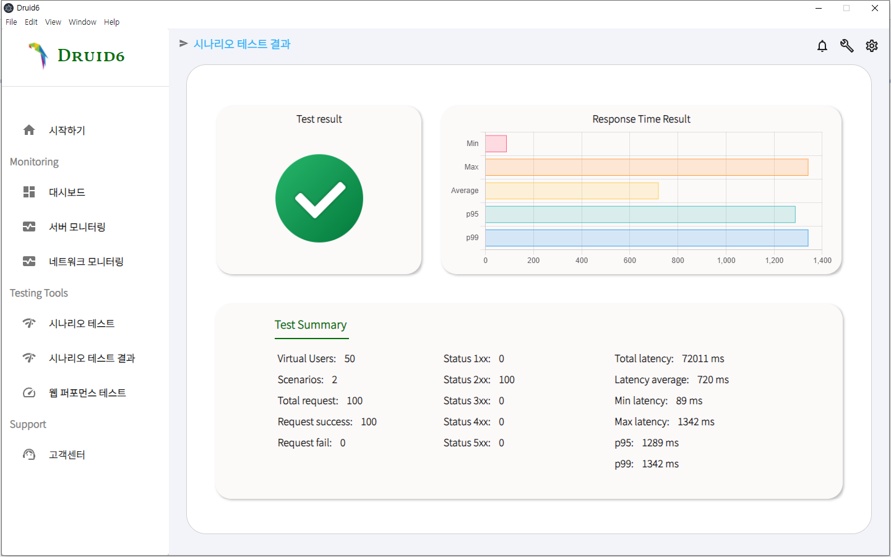

# Druid6 MD 파일

상태: 진행 중
생성일: 2022년 5월 30일 오후 3:30


# Druid6

### 애플리케이션 모니터링의 완벽한 시작, Druid6

> 사용자가 서비스하는 웹 페이지의 퍼포먼스 체크 및 네트워크 모니터링, 시나리오 테스트 등을 할 수 있는 어플리케이션입니다.
> 

서버관리, 시나리오 테스트, 웹 퍼포먼스 체크같은 기능을 제공하여 초보개발자를 위한 서비스

초보개발자를 위한 솔루션 `Druid6`가 제공합니다.

## 주요기능

- 서버 모니터링
- 네트워크 모니터링
- 웹 퍼포먼스 테스트
- 시나리오 테스트

## 세부기능

[세부기능](https://www.notion.so/a21cdd2264e74b13bdf92bc3446c0730)

## 아키텍처



## 설치가이드

- [https://druid6.netlify.app](https://druid6.netlify.app) 에 접속


- 메인페이지의 ‘다운로드’ 버튼 클릭
1. **druid6-0.1.0.exe** 파일 클릭.(관리자 권한 실행 요망)
   
    
    
2. 설치 프로그램이 druid6를 자동으로 설치
   
    
    
3. 설치가 완료되면 **마침** 버튼을 눌러 실행 가능.
   
    
    

## 사용 예시

**시작하기**

> 사용자 서버에 접속할 수 있는 시작하기 페이지입니다.
> 


> 사용자 서버 정보와 PEM 파일을 업로드하면 서버에 접속할 수 있습니다.
> 



**서버 모니터링**

> 서버 정보와 실시간 memory, disk, cpu 정보를 확인할 수 있습니다.
> 


**네트워크 모니터링**

> 실시간 트래픽 정보와 일별 트래픽 정보를 확인할 수 있습니다.
> 


**웹 퍼포먼스 테스트**

> 웹 퍼포먼스를 테스트할 페이지의 URL을 입력해줍니다.
> 



> 테스팅 결과가 나올 때까지 로딩 스피너가 움직입니다.
> 


> 웹 퍼포먼스 테스트 점수 및 핵심 6개 값 세부 설명, 메인 페이지 스크린샷이 출력됩니다. 데스크톱 & 모바일 탭을 눌러 각 버전 별 점수를 확인할 수 있습니다.
> 



> 성능 향상 솔루션 및 예상 절감 시간을 제공해줍니다.
> 


> 자신이 입력한 URL 페이지를 비롯해 다른 유명 웹 사이트와 웹 퍼포먼스 결과를 비교할 수 있습니다.
> 


**시나리오 테스트**

> 시나리오를 만들어 사용자 API를 테스트할 수 있습니다.
가상 유저수 또한 자유롭게 설정하여 테스트 가능합니다.
Response에서 받아온 값을 변수에 담아 다른 시나리오에서 사용 가능합니다.



> 테스팅 결과가 나올 때까지 로딩 스피너가 움직입니다.




> 시나리오 테스트 결과를 표시해줍니다.
> 



## 개발 설정

- [Wiki - 개발 환경 가이드](https://lab.ssafy.com/ssafy_opensource/5th_blockai/-/wikis/%EA%B0%9C%EB%B0%9C-%ED%99%98%EA%B2%BD-%EA%B0%80%EC%9D%B4%EB%93%9C), [Wiki - 서버 배포 가이드](https://lab.ssafy.com/ssafy_opensource/5th_blockai/-/wikis/%EC%84%9C%EB%B2%84-%EB%B0%B0%ED%8F%AC-%EA%B0%80%EC%9D%B4%EB%93%9C)탭 확인.
- MacOS 미지원 상태(2022.05.30 기준)
- Windows는 Wiki 대로 진행.

## 릴리즈 히스토리

히스토리 작성이 필요한 경우, 영어로 작성하되, 괄호 안에 한글 설명을 첨부하셔도 됩니다.

- 0.0.1
    - Work in progress

## 팀원정보

- 김태호 – [https://github.com/onys-programmer](https://github.com/onys-programmer)
- 박윤지 – [ssafy_coach_70@ssafy.com](mailto:ssafy_coach_70@ssafy.com)
- 서형준 – kennyseo454@gmail.com
- 신동호 - [https://github.com/sdh98429](https://github.com/sdh98429)
- 오윤기 - [@orobot13](https://github.com/Yun-GiOh/)
- 현종일 - [https://github.com/Leo-SingleDay](https://github.com/Leo-SingleDay)

## 컨트리뷰트 가이드

1. 해당 프로젝트를 Fork 하세요
2. feature 브랜치를 생성하세요 (`git checkout -b feature/fooBar`)
3. 변경사항을 commit 하세요 (`git commit -am 'Add some fooBar'`)
4. 브랜치에 Push 하세요 (`git push origin feature/fooBar`)
5. 새로운 Merge Request를 요청하세요

## 라이선스

Distributed under the SGPL license. See [License](https://www.notion.so/LICENSE) for more information.

<!-- Markdown link & img dfn's -->
[npm-image]: https://img.shields.io/npm/v/datadog-metrics.svg?style=flat-square(https://img.shields.io/npm/v/datadog-metrics.svg?style=flat-square)
[npm-url]: https://npmjs.org/package/datadog-metrics(https://npmjs.org/package/datadog-metrics)
[npm-downloads]: https://img.shields.io/npm/dm/datadog-metrics.svg?style=flat-square(https://img.shields.io/npm/dm/datadog-metrics.svg?style=flat-square)
[travis-image]: https://img.shields.io/travis/dbader/node-datadog-metrics/master.svg?style=flat-square(https://img.shields.io/travis/dbader/node-datadog-metrics/master.svg?style=flat-square)
[travis-url]: https://travis-ci.org/dbader/node-datadog-metrics(https://travis-ci.org/dbader/node-datadog-metrics)
[wiki]: https://lab.ssafy.com/ssafy_coach_5th/open-source-template/wikis/home(https://lab.ssafy.com/ssafy_coach_5th/open-source-template/wikis/home)

```jsx
Copyright (c) Druid6 contributors
Copyright (c) 2013-2020 GitHub Inc.

Permission is hereby granted, free of charge, to any person obtaining
a copy of this software and associated documentation files (the
"Software"), to deal in the Software without restriction, including
without limitation the rights to use, copy, modify, merge, publish,
distribute, sublicense, and/or sell copies of the Software, and to
permit persons to whom the Software is furnished to do so, subject to
the following conditions:

The above copyright notice and this permission notice shall be
included in all copies or substantial portions of the Software.

THE SOFTWARE IS PROVIDED "AS IS", WITHOUT WARRANTY OF ANY KIND,
EXPRESS OR IMPLIED, INCLUDING BUT NOT LIMITED TO THE WARRANTIES OF
MERCHANTABILITY, FITNESS FOR A PARTICULAR PURPOSE AND
NONINFRINGEMENT. IN NO EVENT SHALL THE AUTHORS OR COPYRIGHT HOLDERS BE
LIABLE FOR ANY CLAIM, DAMAGES OR OTHER LIABILITY, WHETHER IN AN ACTION
OF CONTRACT, TORT OR OTHERWISE, ARISING FROM, OUT OF OR IN CONNECTION
WITH THE SOFTWARE OR THE USE OR OTHER DEALINGS IN THE SOFTWARE.
```